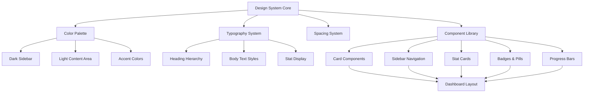

# Design Document: UI Redesign - Modern Health Dashboard Aesthetic

## Overview

This design transforms the existing personal finance tracker from a standard blue/white interface into a modern, sophisticated dashboard inspired by contemporary health tracking applications. The redesign introduces a dark sidebar with lime green accents, a light cream background, elevated card layouts, and improved visual hierarchy while maintaining all existing functionality across dashboard, expenses, savings, budget, and goals pages.

The visual transformation prioritizes clarity, modern aesthetics, and improved user experience through better spacing, typography, and color psychology. The dark sidebar provides visual grounding and focus, while the lime green accent creates energy and positive reinforcement for financial health monitoring.

## Architecture

The redesign maintains the existing HTML structure and JavaScript functionality while completely overhauling the CSS styling system. The architecture focuses on a component-based styling approach with consistent design tokens.



## Components and Interfaces

### Component 1: Design Token System

**Purpose**: Establish a centralized design language through CSS custom properties for consistency and maintainability.

**Interface**:
```css
:root {
  /* Color Palette */
  --accent-lime: #c5f82a;
  --sidebar-dark: #2a2a2a;
  --bg-cream: #f5f3ed;
  --bg-white: #ffffff;
  --text-dark: #1a1a1a;
  --text-medium: #666666;
  --text-light: #999999;
  
  /* Data Visualization */
  --chart-purple: #a78bfa;
  --chart-lime: #c5f82a;
  --chart-gray: #4a4a4a;
  --chart-light-purple: #ddd6fe;
  
  /* Spacing */
  --radius-md: 16px;
  --radius-lg: 24px;
  --shadow-soft: 0 2px 8px rgba(0, 0, 0, 0.08);
  --shadow-elevated: 0 4px 16px rgba(0, 0, 0, 0.12);
  
  /* Typography */
  --font-heading: 'Inter', -apple-system, BlinkMacSystemFont, 'Segoe UI', sans-serif;
  --font-body: 'Inter', -apple-system, BlinkMacSystemFont, 'Segoe UI', sans-serif;
}
```

**Responsibilities**:
- Define all color values, spacing, shadows, and typography
- Provide consistent design language across all components
- Enable easy theme adjustments through centralized token management
- Support responsive scaling and accessibility requirements

### Component 2: Dark Sidebar Navigation

**Purpose**: Fixed left sidebar providing primary navigation with dark charcoal background and lime green accents for active states.

**Interface**:
```css
.sidebar {
  width: 260px;
  background: var(--sidebar-dark);
  position: fixed;
  height: 100vh;
  display: flex;
  flex-direction: column;
}

.sidebar-logo {
  padding: 24px;
  color: var(--accent-lime);
  font-weight: 700;
  font-size: 1.2rem;
}

.nav-item {
  color: rgba(255, 255, 255, 0.7);
  padding: 12px 24px;
  transition: all 0.2s;
}

.nav-item:hover {
  background: rgba(197, 248, 42, 0.1);
  color: var(--accent-lime);
}

.nav-item.active {
  background: rgba(197, 248, 42, 0.15);
  color: var(--accent-lime);
  border-left: 3px solid var(--accent-lime);
}
```

**Responsibilities**:
- Provide persistent navigation across all pages
- Display logo, menu items, and user profile section
- Handle active state visualization with lime green accent
- Include upgrade/CTA section at bottom
- Maintain fixed positioning during scroll
- Support responsive collapse on mobile devices

### Component 3: Cream Background Content Area

**Purpose**: Main content container with light cream background providing visual separation from sidebar and reducing eye strain.

**Interface**:
```css
.main-content {
  margin-left: 260px;
  background: var(--bg-cream);
  min-height: 100vh;
  padding: 32px;
}

.page-header {
  margin-bottom: 32px;
}

.page-title {
  font-size: 2rem;
  font-weight: 800;
  color: var(--text-dark);
  letter-spacing: -0.5px;
  margin-bottom: 8px;
}
```

**Responsibilities**:
- Provide neutral, warm background for content
- Handle responsive padding and margins
- Support grid-based card layouts
- Maintain optimal reading width and spacing
- Ensure sufficient contrast with white cards

### Component 4: Elevated Card System

**Purpose**: White cards with rounded corners and soft shadows creating depth and visual hierarchy.

**Interface**:
```css
.card {
  background: var(--bg-white);
  border-radius: var(--radius-lg);
  padding: 24px;
  box-shadow: var(--shadow-soft);
  transition: box-shadow 0.2s;
}

.card:hover {
  box-shadow: var(--shadow-elevated);
}

.card-header {
  display: flex;
  justify-content: space-between;
  align-items: center;
  margin-bottom: 20px;
}

.card-title {
  font-size: 1.1rem;
  font-weight: 700;
  color: var(--text-dark);
}
```

**Responsibilities**:
- Create visual separation between content sections
- Provide consistent padding and spacing
- Support various content types (stats, lists, charts)
- Handle hover effects for interactivity
- Maintain accessibility with sufficient contrast

### Component 5: Stat Card Components

**Purpose**: Specialized cards displaying key financial metrics with icon badges, large numbers, and small labels.

**Interface**:
```css
.stat-card {
  background: var(--bg-white);
  border-radius: var(--radius-md);
  padding: 20px;
  box-shadow: var(--shadow-soft);
  display: flex;
  flex-direction: column;
  gap: 12px;
}

.stat-header {
  display: flex;
  justify-content: space-between;
  align-items: flex-start;
}

.stat-icon-badge {
  width: 40px;
  height: 40px;
  border-radius: 10px;
  background: rgba(197, 248, 42, 0.15);
  display: flex;
  align-items: center;
  justify-content: center;
  font-size: 1.2rem;
}

.stat-label {
  font-size: 0.7rem;
  font-weight: 600;
  text-transform: uppercase;
  letter-spacing: 0.8px;
  color: var(--text-medium);
}

.stat-value {
  font-size: 2.4rem;
  font-weight: 800;
  color: var(--text-dark);
  font-variant-numeric: tabular-nums;
  line-height: 1;
}

.stat-change {
  font-size: 0.85rem;
  color: var(--text-light);
}
```

**Responsibilities**:
- Display financial metrics prominently
- Use icon badges for visual categorization
- Support percentage badges for changes
- Maintain tabular number formatting for alignment
- Handle positive/negative value styling with colors

### Component 6: Typography System

**Purpose**: Establish clear visual hierarchy through font sizes, weights, and spacing.

**Interface**:
```css
.heading-xl {
  font-size: 2.4rem;
  font-weight: 800;
  line-height: 1.1;
  letter-spacing: -0.8px;
  color: var(--text-dark);
}

.heading-lg {
  font-size: 1.8rem;
  font-weight: 700;
  line-height: 1.2;
  letter-spacing: -0.5px;
  color: var(--text-dark);
}

.body-default {
  font-size: 0.9rem;
  line-height: 1.6;
  color: var(--text-medium);
}

.label-small {
  font-size: 0.7rem;
  font-weight: 600;
  text-transform: uppercase;
  letter-spacing: 0.8px;
  color: var(--text-medium);
}

.stat-number {
  font-size: 2.4rem;
  font-weight: 800;
  font-variant-numeric: tabular-nums;
  line-height: 1;
}
```

**Responsibilities**:
- Define heading hierarchy for all page sections
- Establish readable body text sizing
- Create consistent label styling
- Support special number formatting for financial data
- Maintain accessibility with sufficient contrast ratios

### Component 7: Button and Badge System

**Purpose**: Interactive elements with rounded corners and lime green primary styling.

**Interface**:
```css
.btn-primary {
  background: var(--accent-lime);
  color: var(--sidebar-dark);
  padding: 10px 20px;
  border-radius: 10px;
  font-weight: 600;
  font-size: 0.875rem;
  border: none;
  cursor: pointer;
  transition: all 0.2s;
}

.btn-primary:hover {
  background: #b8e827;
  transform: translateY(-1px);
  box-shadow: 0 4px 12px rgba(197, 248, 42, 0.3);
}

.btn-ghost {
  background: transparent;
  color: var(--text-medium);
  padding: 10px 20px;
  border-radius: 10px;
  border: 1px solid var(--text-light);
  transition: all 0.2s;
}

.badge-pill {
  padding: 4px 12px;
  border-radius: 100px;
  font-size: 0.75rem;
  font-weight: 600;
  background: rgba(197, 248, 42, 0.15);
  color: var(--accent-lime);
}

.badge-percentage {
  display: inline-flex;
  align-items: center;
  gap: 4px;
  padding: 2px 8px;
  border-radius: 100px;
  font-size: 0.7rem;
  font-weight: 700;
}

.badge-percentage.positive {
  background: rgba(34, 197, 94, 0.15);
  color: #16a34a;
}

.badge-percentage.negative {
  background: rgba(239, 68, 68, 0.15);
  color: #dc2626;
}
```

**Responsibilities**:
- Provide primary and secondary button styles
- Support ghost button variants for less prominent actions
- Create pill-shaped badges for status indicators
- Handle percentage badges with positive/negative colors
- Maintain consistent rounded corner styling

### Component 8: Progress Bar Components

**Purpose**: Colorful rounded progress bars for budget tracking and goal visualization.

**Interface**:
```css
.progress-container {
  width: 100%;
  height: 8px;
  background: rgba(0, 0, 0, 0.08);
  border-radius: 100px;
  overflow: hidden;
}

.progress-fill {
  height: 100%;
  border-radius: 100px;
  transition: width 0.4s ease;
}

.progress-fill.lime {
  background: linear-gradient(90deg, var(--accent-lime) 0%, #b8e827 100%);
}

.progress-fill.purple {
  background: linear-gradient(90deg, var(--chart-purple) 0%, #9333ea 100%);
}

.progress-fill.gradient-multi {
  background: linear-gradient(90deg, 
    var(--chart-purple) 0%, 
    var(--accent-lime) 50%, 
    var(--chart-gray) 100%);
}
```

**Responsibilities**:
- Display budget utilization visually
- Show goal progress with smooth animations
- Support multiple color schemes for different contexts
- Use gradient fills for visual interest
- Handle overflow states gracefully

### Component 9: User Profile Section

**Purpose**: Header section displaying user avatar, name, email, and dropdown menu.

**Interface**:
```css
.user-profile-header {
  display: flex;
  align-items: center;
  gap: 12px;
  padding: 16px 24px;
  background: var(--bg-white);
  border-bottom: 1px solid rgba(0, 0, 0, 0.08);
}

.user-avatar {
  width: 48px;
  height: 48px;
  border-radius: 50%;
  background: linear-gradient(135deg, var(--chart-purple) 0%, var(--accent-lime) 100%);
  display: flex;
  align-items: center;
  justify-content: center;
  font-weight: 700;
  color: white;
}

.user-info {
  flex: 1;
}

.user-name {
  font-weight: 700;
  font-size: 0.95rem;
  color: var(--text-dark);
}

.user-email {
  font-size: 0.8rem;
  color: var(--text-medium);
}

.user-dropdown {
  cursor: pointer;
  color: var(--text-light);
}
```

**Responsibilities**:
- Display user identification prominently
- Support avatar images or initials
- Provide access to account settings and logout
- Maintain visual hierarchy in header area
- Handle dropdown menu interactions

### Component 10: Search Bar Component

**Purpose**: Top-right search input with rounded styling and icon.

**Interface**:
```css
.search-bar {
  position: relative;
  width: 100%;
  max-width: 320px;
}

.search-input {
  width: 100%;
  padding: 10px 16px 10px 40px;
  border-radius: 10px;
  border: 1px solid rgba(0, 0, 0, 0.1);
  background: var(--bg-white);
  font-size: 0.875rem;
  transition: all 0.2s;
}

.search-input:focus {
  outline: none;
  border-color: var(--accent-lime);
  box-shadow: 0 0 0 3px rgba(197, 248, 42, 0.15);
}

.search-icon {
  position: absolute;
  left: 12px;
  top: 50%;
  transform: translateY(-50%);
  color: var(--text-light);
  pointer-events: none;
}
```

**Responsibilities**:
- Provide quick search functionality in header
- Display search icon for visual clarity
- Handle focus states with lime green accent
- Support keyboard navigation
- Maintain responsive width on smaller screens

## Data Models

### Model 1: Color Palette System

```typescript
interface ColorPalette {
  primary: {
    lime: string;           // #c5f82a
    limeHover: string;      // #b8e827
    limeLight: string;      // rgba(197, 248, 42, 0.15)
  };
  
  surfaces: {
    sidebarDark: string;    // #2a2a2a
    bgCream: string;        // #f5f3ed
    bgWhite: string;        // #ffffff
    cardOverlay: string;    // rgba(255, 255, 255, 0.95)
  };
  
  text: {
    dark: string;           // #1a1a1a
    medium: string;         // #666666
    light: string;          // #999999
    onDark: string;         // rgba(255, 255, 255, 0.9)
    onDarkMuted: string;    // rgba(255, 255, 255, 0.6)
  };
  
  dataViz: {
    purple: string;         // #a78bfa
    lightPurple: string;    // #ddd6fe
    lime: string;           // #c5f82a
    gray: string;           // #4a4a4a
    lightGray: string;      // #e5e7eb
  };
  
  semantic: {
    success: string;        // #16a34a
    warning: string;        // #d97706
    danger: string;         // #dc2626
    info: string;           // #2563eb
  };
}
```

**Validation Rules**:
- All color values must be valid CSS color formats (hex, rgba)
- Contrast ratios must meet WCAG AA standards (4.5:1 for normal text, 3:1 for large text)
- Primary lime green (#c5f82a) must be used consistently for all accent elements
- Dark sidebar (#2a2a2a) must maintain sufficient contrast with text
- Background cream (#f5f3ed) must provide sufficient contrast with white cards

### Model 2: Typography Scale

```typescript
interface TypographyScale {
  headings: {
    xl: {
      fontSize: string;      // 2.4rem
      fontWeight: number;    // 800
      lineHeight: number;    // 1.1
      letterSpacing: string; // -0.8px
    };
    lg: {
      fontSize: string;      // 1.8rem
      fontWeight: number;    // 700
      lineHeight: number;    // 1.2
      letterSpacing: string; // -0.5px
    };
    md: {
      fontSize: string;      // 1.2rem
      fontWeight: number;    // 700
      lineHeight: number;    // 1.3
    };
  };
  
  body: {
    default: {
      fontSize: string;      // 0.9rem
      lineHeight: number;    // 1.6
    };
    small: {
      fontSize: string;      // 0.8rem
      lineHeight: number;    // 1.5
    };
  };
  
  labels: {
    uppercase: {
      fontSize: string;      // 0.7rem
      fontWeight: number;    // 600
      textTransform: string; // uppercase
      letterSpacing: string; // 0.8px
    };
  };
  
  stats: {
    largeNumber: {
      fontSize: string;      // 2.4rem (range: 2rem - 3rem)
      fontWeight: number;    // 800
      fontVariant: string;   // tabular-nums
      lineHeight: number;    // 1
    };
  };
}
```

**Validation Rules**:
- Font sizes must use rem units for accessibility
- Line heights must be unitless for proper scaling
- Stat numbers must use tabular-nums for alignment
- Letter spacing must be tight on large headings (-0.5px to -0.8px)
- All text must maintain readable contrast ratios

### Model 3: Spacing System

```typescript
interface SpacingSystem {
  padding: {
    xs: string;     // 4px
    sm: string;     // 8px
    md: string;     // 16px
    lg: string;     // 24px
    xl: string;     // 32px
    xxl: string;    // 48px
  };
  
  gaps: {
    card: string;   // 16px
    section: string; // 24px
    page: string;   // 32px
  };
  
  radius: {
    sm: string;     // 8px
    md: string;     // 16px
    lg: string;     // 24px
    full: string;   // 100px (pill shape)
  };
  
  shadows: {
    soft: string;      // 0 2px 8px rgba(0, 0, 0, 0.08)
    elevated: string;  // 0 4px 16px rgba(0, 0, 0, 0.12)
    focus: string;     // 0 0 0 3px rgba(197, 248, 42, 0.15)
  };
}
```

**Validation Rules**:
- Spacing values must follow 4px grid system
- Card padding should be consistent (24px)
- Border radius for cards should be 16-24px
- Shadows must use subtle transparency for depth
- Focus shadows must use lime green accent color

### Model 4: Component State Variations

```typescript
interface ComponentStates {
  button: {
    default: ButtonStyle;
    hover: ButtonStyle;
    active: ButtonStyle;
    disabled: ButtonStyle;
    focus: ButtonStyle;
  };
  
  card: {
    default: CardStyle;
    hover: CardStyle;
    selected: CardStyle;
  };
  
  input: {
    default: InputStyle;
    focus: InputStyle;
    error: InputStyle;
    disabled: InputStyle;
  };
  
  navItem: {
    default: NavStyle;
    hover: NavStyle;
    active: NavStyle;
  };
}

interface ButtonStyle {
  background: string;
  color: string;
  borderColor: string;
  shadow: string;
  transform: string;
}

interface CardStyle {
  shadow: string;
  borderColor: string;
  transform: string;
}

interface InputStyle {
  borderColor: string;
  shadow: string;
  background: string;
}

interface NavStyle {
  background: string;
  color: string;
  borderLeft: string;
}
```

**Validation Rules**:
- All interactive elements must have hover states
- Focus states must use lime green accent for keyboard navigation
- Disabled states must reduce opacity to 0.5
- Active navigation items must show lime green accent and left border
- Transitions must be smooth (0.2s duration)

## Error Handling

### Error Scenario 1: Color Contrast Failures

**Condition**: When text color combinations fail WCAG AA contrast requirements
**Response**: Provide fallback color values with sufficient contrast
**Recovery**: 
- Check all text/background combinations during development
- Use browser DevTools to audit contrast ratios
- Provide dark text on light backgrounds and light text on dark backgrounds
- Ensure lime green (#c5f82a) has dark text overlay (#2a2a2a) for readability

### Error Scenario 2: Responsive Layout Breaking

**Condition**: When sidebar and content area overlap on smaller screens
**Response**: Implement mobile-first breakpoints with collapsible sidebar
**Recovery**:
- Transform sidebar off-canvas on screens < 768px
- Provide hamburger menu toggle in header
- Overlay dark backdrop when mobile menu is open
- Maintain touch-friendly tap targets (minimum 44px)
- Test on various device sizes (320px to 1920px)

### Error Scenario 3: Missing Font Fallbacks

**Condition**: When Inter font fails to load from Google Fonts
**Response**: Graceful degradation to system fonts
**Recovery**:
- Define comprehensive font stack: 'Inter', -apple-system, BlinkMacSystemFont, 'Segoe UI', sans-serif
- Use font-display: swap for performance
- Maintain similar metrics with fallback fonts
- Test appearance with fallback fonts

### Error Scenario 4: Shadow and Border Rendering Issues

**Condition**: When browser doesn't support certain shadow values or rounded corners properly
**Response**: Provide simpler fallback styles
**Recovery**:
- Use @supports queries for advanced features
- Provide solid border fallbacks for shadows
- Test in older browsers (last 2 versions)
- Simplify shadows on lower-end devices
- Ensure core functionality works without decorative shadows

### Error Scenario 5: Icon Display Failures

**Condition**: When emoji icons don't render consistently across platforms
**Response**: Replace emojis with SVG icons or icon font
**Recovery**:
- Consider using icon library (Heroicons, Lucide, Font Awesome)
- Provide accessible labels for screen readers
- Use aria-hidden on decorative icons
- Ensure icons scale properly with text size
- Test icon rendering across Windows, macOS, iOS, Android

## Testing Strategy

### Unit Testing Approach

**CSS Component Testing**:
- Test individual component styles in isolation using CSS testing tools
- Verify color token values match design specifications
- Check spacing and padding calculations
- Validate responsive breakpoint behavior
- Test component state transitions (hover, focus, active)

**Accessibility Testing**:
- Verify color contrast ratios using automated tools (axe, Lighthouse)
- Test keyboard navigation through all interactive elements
- Validate focus indicators are visible and use lime green accent
- Check screen reader announcements for all UI elements
- Test with browser zoom levels (100%, 125%, 150%, 200%)

**Visual Regression Testing**:
- Capture baseline screenshots of all pages
- Compare screenshots after CSS changes
- Test across multiple browsers (Chrome, Firefox, Safari, Edge)
- Verify card layouts and spacing consistency
- Check for unexpected text wrapping or overflow

### Integration Testing Approach

**Cross-Component Testing**:
- Verify sidebar navigation integrates with content area properly
- Test card grid layouts at different viewport sizes
- Validate stat cards display correctly with dynamic data
- Check progress bar animations and color transitions
- Test modal overlays with backdrop interactions

**Responsive Design Testing**:
- Test on mobile devices (320px - 480px)
- Test on tablets (481px - 768px)
- Test on desktop (769px - 1920px)
- Test on ultrawide displays (> 1920px)
- Verify sidebar collapse/expand behavior
- Check touch interactions on mobile devices

### Browser Compatibility Testing

**Target Browsers**:
- Chrome (last 2 versions)
- Firefox (last 2 versions)
- Safari (last 2 versions)
- Edge (last 2 versions)

**Testing Focus**:
- CSS Grid and Flexbox layout compatibility
- Custom property (CSS variables) support
- Border radius rendering
- Shadow rendering quality
- Font rendering consistency
- Transition and animation smoothness

## Performance Considerations

**CSS Optimization**:
- Minimize CSS file size by removing unused styles
- Use CSS custom properties for theming instead of duplicated values
- Leverage browser caching for external fonts
- Implement critical CSS inlining for above-the-fold content
- Consider CSS minification for production

**Font Loading Strategy**:
- Use font-display: swap to prevent invisible text
- Preload Inter font for faster rendering
- Limit font weights to only those needed (400, 600, 700, 800)
- Consider variable fonts to reduce file size
- Subset fonts to include only Latin characters if applicable

**Animation Performance**:
- Use transform and opacity for smooth animations
- Avoid animating expensive properties (width, height, top, left)
- Use will-change sparingly for performance-critical animations
- Limit animation duration to 200-400ms for responsiveness
- Test on lower-end devices for smooth 60fps performance

**Layout Performance**:
- Use CSS Grid for dashboard layouts (better performance than nested flexbox)
- Minimize DOM depth for faster rendering
- Avoid layout thrashing in JavaScript interactions
- Use contain: layout for isolated card components
- Implement lazy loading for off-screen card content

## Security Considerations

**CSS Security**:
- Sanitize any user-generated content before rendering
- Avoid inline styles from untrusted sources
- Use Content Security Policy (CSP) headers
- Prevent CSS injection attacks through input validation
- Validate color values if user-customizable themes are added

**Accessibility as Security**:
- Ensure all interactive elements are keyboard accessible (prevents locked-out users)
- Provide sufficient focus indicators (prevents confusion attacks)
- Use semantic HTML for proper screen reader support
- Implement skip links for keyboard navigation
- Ensure color is not the only indicator of state (supports colorblind users)

## Dependencies

**External Dependencies**:
- Google Fonts: Inter font family (weights: 400, 600, 700, 800)
- No CSS framework dependencies (vanilla CSS)
- No JavaScript UI libraries (maintains existing vanilla JS)

**Browser Requirements**:
- CSS Grid support (required)
- CSS Custom Properties support (required)
- Flexbox support (required)
- CSS Transitions support (recommended)
- @supports query support (recommended)

**Font Loading**:
- Primary: Google Fonts CDN for Inter font family
- Fallback: System font stack (-apple-system, BlinkMacSystemFont, 'Segoe UI', sans-serif)
- Method: Preconnect to fonts.googleapis.com and fonts.gstatic.com

**Development Tools**:
- Browser DevTools for CSS debugging and contrast checking
- Lighthouse for accessibility and performance auditing
- Responsive design mode for testing multiple viewport sizes
- Color contrast checker for WCAG compliance validation
